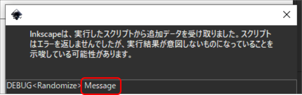
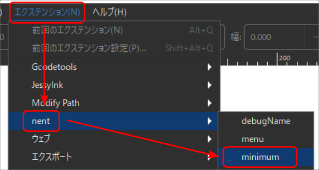

# PythonによるInkscapeエクステンション開発

## 実行環境

OS : Windows 10 Home (10.0.1904)

Inkscape : 1.0.1 

## エクステンションに必要なファイル

エクステンションにはinx(中身はxml)ファイルとpyファイルが必要です。inxファイルとpyファイルの名前は同じである必要があります。

* inxファイル：エクステンションに関する情報、必要ならダイアログのGUIを定義する。
* pyファイル：エクステンションの処理を実装する。

## Memo

### デバッグメッセージの出力

```python
inkex.base.InkscapeExtension.debug("Message")
```



## サンプル

### インストール・実行方法

フォルダをinkscapeのユーザーエクステンションフォルダへ配置するだけです。inkscapeを起動するとエクステンションメニューに項目が追加されています。

#### ユーザーエクステンションの場所

**[編集]→[Inkscapeの設定(Ctrl+Shift+P)]→[システム]→[ユーザーエクステンション]**から確認できます。

### minimum

inkscapeのエクステンションメニューに項目を追加するだけのサンプル。スクリプトファイルは空なので実行しても何も起こりません。



<id>要素に一意の識別子(書式例:自分の名前.組織名.エクステンション名)を指定します。

```xml
<id>nora.nent.minimum</id>
```

<name>要素で指定したテキストがメニューに表示されます。

```xml
<name>minimum</name>
```

<submenu>要素を指定してメニューアイテムの表示をコントロールします。<submenu>要素はネスト可能です。

```xml
<effect>
	<effects-menu>
		<submenu name="nent"/>
	</effects-menu>
</effect>
```

<command>要素にスクリプトファイルの相対パスを指定します。

```xml
<command location="inx" interpreter="python">minimum.py</command>
```

## setColor

選択しているテキストオブジェクトに色を指定するサンプルです。